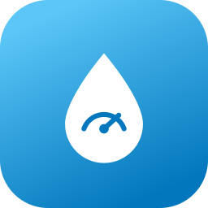

# ioBroker.suru-watermonitor

**Tests:** 

## suru-watermonitor adapter for ioBroker

Reads data of the SURU WaterMonitor water meter / pipe monitor from the SURU cloud.
The cloud API is not public and was reverse engineered, see also the
[Home Assistant integration](https://github.com/teuffel/homeassistant-suru-watermonitor) this adapter is ported from.

### Configuration

| Setting | Description |
|---------|-------------|
| E-Mail / Password | Credentials of your SURU account (the same as in the SURU app). The password is stored encrypted. |
| Poll interval | Minutes between cloud requests, 5 to 1440 (default 60). |

### States

One device is created per unit on the account (`suru-watermonitor.0.<unitId>.*`):

| State | Description |
|-------|-------------|
| `meterReading` | Meter reading in m³ |
| `consumptionToday` | Consumption since 00:00 UTC in l |
| `waterHardness` | Water hardness in °dH |
| `phValue` | pH value |
| `lastMeasured` | Timestamp of the last measurement |
| `alarm` | `true` if the pipe monitor reports an active alarm or incident |
| `activeIncidents` | JSON array of active incident types (`highFlow`, `continuousWaterFlow`, `temperature`, `lowFlow`) |

`info.connection` shows whether the last cloud request succeeded.

### Disclaimer

This is an unofficial adapter. It is not affiliated with, endorsed by or supported by SURU / SenseGuard.
All product names and logos are property of their respective owners.

## Changelog
<!--
    Placeholder for the next version (at the beginning of the line):
    ### **WORK IN PROGRESS**
-->
### 0.1.0 (2026-10-07)
* (NurPech) initial release

## License
MIT License

Copyright (c) 2026 M1kad0 <leonie+iobroker@sgessinger.de>

Permission is hereby granted, free of charge, to any person obtaining a copy
of this software and associated documentation files (the "Software"), to deal
in the Software without restriction, including without limitation the rights
to use, copy, modify, merge, publish, distribute, sublicense, and/or sell
copies of the Software, and to permit persons to whom the Software is
furnished to do so, subject to the following conditions:

The above copyright notice and this permission notice shall be included in all
copies or substantial portions of the Software.

THE SOFTWARE IS PROVIDED "AS IS", WITHOUT WARRANTY OF ANY KIND, EXPRESS OR
IMPLIED, INCLUDING BUT NOT LIMITED TO THE WARRANTIES OF MERCHANTABILITY,
FITNESS FOR A PARTICULAR PURPOSE AND NONINFRINGEMENT. IN NO EVENT SHALL THE
AUTHORS OR COPYRIGHT HOLDERS BE LIABLE FOR ANY CLAIM, DAMAGES OR OTHER
LIABILITY, WHETHER IN AN ACTION OF CONTRACT, TORT OR OTHERWISE, ARISING FROM,
OUT OF OR IN CONNECTION WITH THE SOFTWARE OR THE USE OR OTHER DEALINGS IN THE
SOFTWARE.